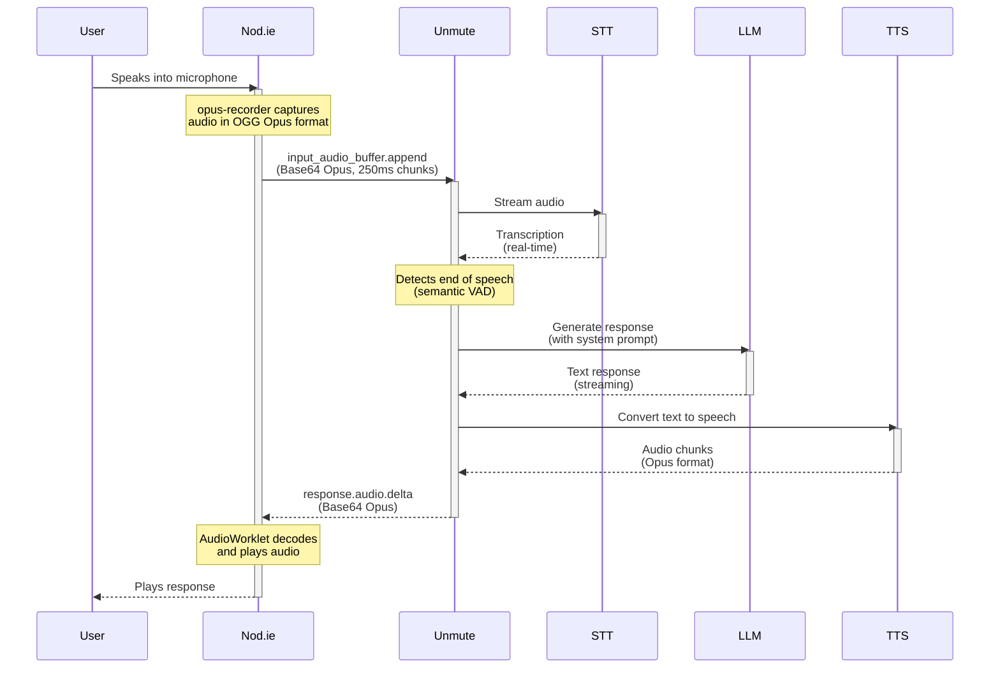

# Nod.ie - AI Voice Assistant

> 🎨 **Vibe Coded** with [Claude Code](https://claude.ai/code)

Nod.ie (pronounced "Nodey" or "Node-ee") is an always-available AI voice assistant that integrates with Kyutai Unmute for natural voice conversations. Originally created to assist with running Bitcoin and Lightning nodes, Nod.ie can manage LND channels, execute Lightning payments, and serve as a general PC assistant or interactive tutor. Designed to work with the black-panther home server.


## Features

- 🎤 Push-to-talk with global hotkey (Ctrl+Shift+Space)
- 🔊 Natural voice synthesis using Kyutai Unmute
- 🎯 Small, draggable overlay interface
- 🔗 N8N webhook integration for automation
- 💬 Real-time voice conversations

## Prerequisites

### System Requirements
- **OS**: Linux (built and tested on Kubuntu 24.04) or macOS
- **RAM**: 8GB minimum (16GB recommended)
- **GPU**: NVIDIA GPU with 12GB+ VRAM recommended for optimal performance
- **Storage**: 2GB for Unmute models
- **Microphone**: Any standard USB or built-in microphone
- **Audio Output**: Speakers or headphones

### Software Dependencies
- **Node.js**: Version 16+ with npm
- **Docker**: For running Unmute services
- **Kyutai Unmute**: Real-time voice AI system
  - Provides <200ms latency voice conversations
  - Includes STT (Whisper), LLM (via Ollama), and TTS models
  - Requires GPU for optimal performance (CPU mode available)

### AI Stack Requirements
The following services must be running (typically via Docker):
- **unmute-backend**: WebSocket server on port 8765
- **unmute-stt**: Speech-to-text service (Moshi-based, ~2.6GB VRAM)
- **unmute-tts**: Text-to-speech service (Moshi-based, ~6.4GB VRAM)
- **ollama**: LLM inference (requires ~4-8GB VRAM for good performance)

To start these services:
```bash
# Navigate to your Unmute/AI stack directory
docker compose up -d
```

**GPU Memory Requirements**: The full stack requires ~12-16GB VRAM total. Ensure other GPU-intensive services are stopped to avoid CPU fallback.

## Installation

```bash
# Clone the repository
git clone https://github.com/KnowAll-AI/Nod.ie.git
cd Nod.ie

# Install dependencies
npm install

# Copy required decoder files (if not already present)
cp node_modules/opus-recorder/dist/decoderWorker.min.wasm .

# Create environment configuration
cp .env.example .env
# Edit .env with your configuration
```

### Required Files

Nod.ie uses the Opus decoder for audio playback:
- `decoderWorker.min.js` - Opus decoder worker (included)
- `decoderWorker.min.wasm` - WebAssembly module (copy from node_modules as shown above)

## Running Nod.ie

```bash
npm start
```

Nod.ie will appear as a small circular overlay on your screen. 

## Usage

Nod.ie is an always-listening voice assistant that responds to your voice commands in real-time.

1. Nod.ie starts listening automatically when launched (purple glow)
2. Speak naturally - Nod.ie is always listening unless muted
3. Nod.ie will respond with natural voice
4. Click to mute/unmute (red = muted, purple = listening)

### Controls

- **Click**: Toggle mute/unmute
- **Long press (hold 300ms)**: Drag the window to a new position
- **Right-click**: Open menu
- **Ctrl+Shift+Space**: Toggle mute from anywhere
- **Ctrl+Shift+A**: Show Nod.ie window

### Visual States

- **Gray spinning**: Loading/connecting to services
- **Purple**: Listening (unmuted)
- **Purple pulsing**: Processing/thinking
- **Red**: Muted
- **White ring**: Audio activity visualization

## Configuration

### Settings
Settings are stored in `~/.config/nodie/config.json`:
- `globalHotkey`: Customize the push-to-talk key
- `n8nWebhookUrl`: Set your N8N webhook for notifications
- `voice`: Choose voice model (default: explanation voice)

### System Prompt
Customize Nod.ie's personality and capabilities by editing `SYSTEM-PROMPT.md`. This file contains:
- Core identity and personality traits
- Communication style guidelines
- Capability descriptions
- Response examples

Changes to SYSTEM-PROMPT.md take effect on next restart.

## Integration with Claude Code

Nod.ie can work alongside Claude Code. While Claude Code handles text-based interactions, Nod.ie provides voice interface to the same AI services.

## Technical Architecture

### Overview
Nod.ie is built as an Electron desktop application that provides an always-on voice interface to AI models through Kyutai Unmute's real-time voice conversation system.

```mermaid
graph TB
    subgraph User_Interface ["👤 User Interface"]
        User["👤 User"]
        Mic["🎤 Microphone"]
        Speaker["🔊 Speaker"]
    end
    
    subgraph Nod_ie ["🟣 Nod.ie Electron App"]
        direction TB
        MainProcess["Main Process<br/>(main.js)"]
        Renderer["Renderer Process<br/>(renderer.js)"]
        UI["Circular UI<br/>(index.html)"]
        
        subgraph Modules ["Modules"]
            WSHandler["WebSocket Handler"]
            AudioCapture["Audio Capture<br/>(opus-recorder)"]
            AudioPlayback["Audio Playback<br/>(AudioWorklet)"]
            UIManager["UI Manager"]
        end
        
        MainProcess --> Renderer
        Renderer --> Modules
        UI --> UIManager
    end
    
    subgraph Local_Services ["🖥️ Local Services (Docker)"]
        direction TB
        UnmuteBackend["Unmute Backend<br/>:8765"]
        
        subgraph Unmute_Stack ["Unmute Stack"]
            STT["Speech-to-Text<br/>(Moshi)"]
            TTS["Text-to-Speech<br/>(Moshi)"]
            LLM["LLM<br/>(Ollama)"]
        end
        
        UnmuteBackend --> STT
        UnmuteBackend --> TTS
        UnmuteBackend --> LLM
    end
    
    %% User interactions
    User --> Mic
    Speaker --> User
    Mic --> AudioCapture
    AudioPlayback --> Speaker
    
    %% WebSocket connections
    WSHandler -.->|"WebSocket<br/>ws://localhost:8765"| UnmuteBackend
    
    %% Audio flow
    AudioCapture -->|"Base64 Opus<br/>250ms chunks"| WSHandler
    WSHandler -->|"response.audio.delta"| AudioPlayback
    
    %% Visual feedback
    UIManager -->|"Visual States"| UI
    AudioCapture -->|"Audio Activity"| UIManager
    
    style Nod_ie fill:#9333ea,stroke:#7c3aed,color:#fff
    style Local_Services fill:#1e293b,stroke:#334155,color:#fff
    style User_Interface fill:#059669,stroke:#047857,color:#fff
```



### System Architecture

### Technology Stack
- **Electron**: Cross-platform desktop application framework
- **WebSocket**: Real-time bidirectional communication with Unmute backend
- **Web Audio API**: Audio capture and visualization
- **MediaRecorder API**: Audio streaming with Opus codec
- **Node.js**: Backend runtime

### Architecture Components

#### 1. Main Process (`main.js`)
- Creates frameless, transparent, always-on-top window
- Manages global keyboard shortcuts
- Handles system tray integration
- Stores configuration using electron-store

#### 2. Renderer Process (`renderer.js`)
- Establishes WebSocket connection to Unmute (ws://localhost:8765)
- Captures microphone audio using MediaRecorder API
- Streams audio chunks as base64-encoded Opus data
- Receives and plays TTS audio responses
- Manages UI state and animations

#### 3. User Interface (`index.html`)
- Circular overlay design with CSS animations
- Visual feedback states:
  - Purple (idle/listening)
  - Red (muted)
  - Spinning ring (audio activity)
  - Yellow spin (thinking)
- Draggable window with CSS `-webkit-app-region`

### Audio Pipeline



#### Input (Speech-to-Text)
1. **Capture**: opus-recorder with OGG Opus container format
2. **Streaming**: 250ms chunks sent via WebSocket
3. **Format**: Base64-encoded Opus audio in `input_audio_buffer.append` messages
4. **Processing**: Unmute handles STT using Moshi models (~2.6GB VRAM)

#### Output (Text-to-Speech)
1. **Reception**: `response.audio.delta` messages with base64 Opus audio
2. **Decoding**: AudioWorklet with Opus decoder (WASM)
3. **Playback**: Real-time audio streaming through Web Audio API
4. **Voice**: Configurable (8 available voices)

### WebSocket Protocol
Nod.ie uses a subset of Unmute's WebSocket API:

```javascript
// Session initialization
{
  "type": "session.update",
  "session": {
    "id": "nodie-timestamp",
    "voice": "unmute-prod-website/ex04_narration_longform_00001.wav",
    "model": "unmute-mini",
    "modalities": ["text", "audio"],
    "allow_recording": false
  }
}

// Audio streaming
{
  "type": "input_audio_buffer.append",
  "audio": "base64-encoded-opus-data"
}

// Audio commit (triggers processing)
{
  "type": "input_audio_buffer.commit"
}
```

### Key Implementation Details

1. **Always Listening**: Continuous audio streaming when unmuted
2. **Low Latency**: <200ms response time with local Unmute
3. **Visual Feedback**: Real-time audio visualization using Web Audio API
4. **Error Handling**: Automatic reconnection on WebSocket failure
5. **Privacy**: Click to mute, no audio stored when `allow_recording: false`

### Integration Points

- **Unmute Backend**: WebSocket connection for voice processing
- **Ollama**: LLM inference (via Unmute)
- **n8n**: Webhook notifications for automation
- **Claude Code**: Can trigger TTS through system hooks

## Voice Options

Nod.ie supports multiple voices. The current voice is set to "Explanation" - a clear voice for explanatory content. To change voices, edit `/modules/websocket-handler.js` and use one of these paths:

- `unmute-prod-website/ex04_narration_longform_00001.wav` - Explanation (current)
- `unmute-prod-website/p329_022.wav` - Watercooler
- `unmute-prod-website/freesound/519189_request-42---hmm-i-dont-knowwav.mp3` - Quiz Show (British male)
- `unmute-prod-website/freesound/440565_why-is-there-educationwav.mp3` - Gertrude (warm female)
- `unmute-prod-website/developer-1.mp3` - Dev voice

## Testing

Nod.ie includes a comprehensive test suite to verify functionality:

```bash
# Run all tests (including GUI tests)
node tests/run-all-tests.js

# Run non-GUI tests only (faster)
node tests/run-non-electron-tests.js

# Run interactive browser test
node tests/serve-browser-test.js
# Then open http://localhost:8090
```

Key tests include WebSocket connectivity, audio format validation, and end-to-end voice interaction testing.

## Troubleshooting

| Problem | Solution |
|---------|----------|
| No audio output | • Check Unmute services are running<br>• Verify audio device in system settings<br>• Check Developer Tools console for errors |
| Can't hear me | • Click circle to unmute (should be purple, not red)<br>• Grant microphone permissions<br>• Check audio ring animation when speaking |
| Connection failed | • Verify Unmute at `ws://localhost:8765`<br>• Check Docker containers are healthy<br>• Restart Unmute backend |
| Audio format errors | • Browser must support Opus codec<br>• Try different browser/Electron version<br>• Check Unmute logs for OGG errors |
| Circle moves when clicking | • Fixed in latest version<br>• Restart Nod.ie after update |
| Can't drag window | • Hold click for 300ms before dragging<br>• Check window manager compatibility |

For detailed troubleshooting, see [TROUBLESHOOTING.md](TROUBLESHOOTING.md)