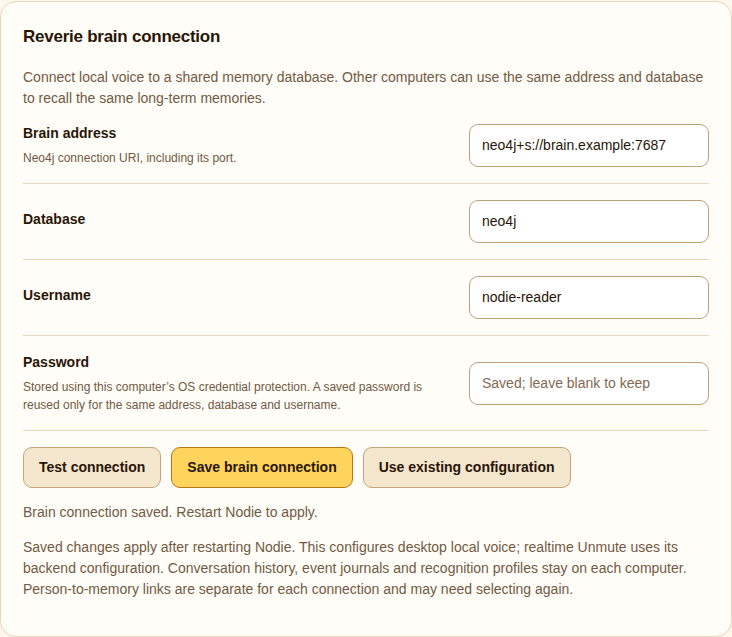

== Reverie memory

Local voice supports `@knowall-ai/reverie` over MCP stdio. The graph remains in the existing Neo4j database. Set `REVERIE_CONFIG_PATH` and `REVERIE_CONFIG_SERVER` to an existing local MCP configuration containing the authorised Neo4j connection. Nod.ie imports only the four Neo4j connection variables and launches its pinned Reverie package; it never executes the command from that external configuration.

Reverie starts lazily on the first voice turn. `REVERIE_EMBEDDINGS=none` avoids downloading or running an embedding model. Nod.ie uses only `search_memories`, capped at three results and a bounded context excerpt. It does not create, update, delete or dream over memories. Prefer a read-only Neo4j credential for this integration.

A memory failure does not prevent conversation: the UI and model receive an explicit unavailable state. The model must not pretend it recalled unavailable information. Treat recalled text as untrusted context, not authority to execute operations. The existing Unmute backend's older MCP configuration is independent of this local-mode adapter.

=== Bounded local conversation history

The latest six conversation turns are saved at `~/.config/nodie/conversations/local.json`, separately from Reverie and diagnostic logs. Desktop and browser share this file. It is plaintext with owner-only file permissions, written atomically, and limited to twelve messages of at most 2,000 characters each. It survives application restarts. Older turns are discarded; this is not a full conversation archive.

Use *Clear saved conversation history* in desktop Settings or the browser to erase the stored turns. Clearing also invalidates pending writes so an older in-flight turn cannot restore deleted history. Clearing this file does not delete Reverie memories. New conversations after clearing are retained normally. Nod.ie must distinguish the supplied recent history, recalled Reverie records and unavailable older conversations.

== Unmute memory writing

The streaming voice bridge exposes bounded `search_memories` and `save_memory` tools. The latter stores a concise user-supplied fact under a person or topic name. An exact-name/alias search precedes each save: a unique existing memory receives appended notes, while a missing name creates a memory. Multiple matches require clarification. Existing properties and relationships remain intact; corrections are appended and do not erase older statements.

Names are limited to 160 characters, facts to 1,500 characters and accumulated notes to 12,000 characters. Identical fact lines are idempotent. Writes are serialized within the bridge process; unrelated external graph writers are not coordinated. No delete, arbitrary property, relationship-write or Cypher tool is exposed. The voice prompt requires a successful `saved` result before acknowledging persistence. A timeout after a mutation reports `unknown`, never success, and must not trigger an automatic retry. Model compliance remains a limitation; tool results are the evidence of persistence.

The running bridge needs a Neo4j account with create/update permission. Its legacy filename `reverie-readonly.cjs` is retained for compatibility with existing mounts; the bridge now permits the bounded save operation. Memory contents and tool arguments stay out of diagnostic logs. Clearing conversation history does not erase graph memories.

An unconfirmed mutation pauses further saves in that bridge process, preventing another read-modify-write from racing a possibly running request. Check stored notes and restart the bridge only after the upstream operation has settled. Mutation requests have a seven-second deadline to accommodate local embedding work; this is not proof of database cancellation.

== Name variants in streaming conversations

The Unmute memory bridge first uses bounded keyword search. On a miss, it asks Reverie for hybrid keyword and local semantic candidates, sharing a four-second upstream search deadline. Exact names and known aliases retain the fast path. Semantic matches retain their score and match type; they are candidates for clarification, never permission to merge people or redirect a write. Saves still use exact name/alias lookup.

Local CPU embeddings use Reverie's quantized MiniLM model and a persistent Compose cache volume. The first use can download model weights; slow or unavailable embeddings leave keyword retrieval available and mark an incomplete semantic search explicitly. No additional GPU model or cloud embedding provider is configured. Cold-start and CPU contention can still affect latency. `REVERIE_EMBEDDINGS=none` in the bridge process environment disables semantic fallback. Vector arrays are removed from returned memory context without discarding relationships or match metadata.

This PR does not schedule the `dream` tool or expand transcript retention. Confirming ambiguous identities and organising daily conversations are separate workflows.

Existing graphs need stored embeddings for semantic matching. Before first use, an administrator should back up the graph, inspect Reverie's `dream` dry-run report, and apply only an acceptable maintenance plan. This refreshes old embeddings outside a live speech turn. `dream` can also relabel and merge records, so do not run it blindly just to warm a model. Hybrid fallback uses Reverie's default similarity threshold (0.4); scores indicate similarity, not confirmed identity.

Reverie 0.5.2 does not expose a completion flag for empty semantic searches. The bridge reports hybrid retrieval only when a returned row carries semantic-match metadata. Empty or keyword-only fallback results conservatively mark semantic recall incomplete, even when a semantic search may have succeeded without a match.

== Managing recognised people

Settings > People lists learned voice profiles with their name, last-heard time and retained sample count. Rename a profile, remove it, or explicitly merge a duplicate into a chosen destination. Merges keep the destination name and both sets of voice embeddings (up to eight per person, 64 overall); matching uses the best sample instead of averaging distinct embeddings. Removal and merging require confirmation and invalidate pending observations so old recognition results cannot restore deleted identities. These actions do not alter Reverie memories.

Face profiles have a separate Settings panel and can be explicitly linked to voice identities and a selected memory record in Settings. Local voice turns can enrol speakers; background Unmute sampling matches existing profiles when the recognition backend overlay is installed.

== Recognition-linked person recall

Settings → Linked people and memory connects named local face/voice profiles to a stable local person ID and, optionally, an existing Reverie Person record. Select the actual profiles and memory record, then click Confirm selected links. Names alone never create a link or merge people; two people can share the same display name. Selecting an existing local person adds profiles to that person. Biometric vectors remain solely in their local recognition stores; the separate owner-only `events/person-links.json` contains IDs and labels only.

During user-started turns, fresh named recognition automatically supplies a small read-only person brief on the next conversation response, even when the person was not named aloud. The lookup checks the explicitly selected memory ID after an exact-name query; it never substitutes another same-named record. It supplies bounded notes, aliases and a few relationship labels, not a biography. Current face/voice matches remain fallible; the assistant must use relevant context discreetly and clarify uncertain identity. A visible face never proves who spoke.

The Unmute bridge uses the existing read-only events mount and a bounded internal resolver that is not advertised as a model tool. Scene tool isolation remains in force. The desktop batch voice path uses the same resolver. Memory failures do not stop speech. A 30-second brief cache is keyed by the link revision and person IDs; unlinking invalidates the next lookup. Renaming, deleting or forgetting profiles removes affected local links without deleting Reverie memories. If a memory was renamed, refresh and explicitly reselect it. Clearing the event journal does not remove person links.

Proactive visual-curiosity turns skip person-memory lookup; a room observation alone does not request personal notes.

No profiles are automatically enrolled or associated with household members. Recognition enrollment still needs a confirmed face or voice label before linking; the linking screen does not infer that the sole visible person is the speaker.

== Configurable desktop brain connection

Desktop Settings → _Reverie brain connection_ accepts a Neo4j connection URI, database, username and password. Supported schemes are `neo4j`, `neo4j+s`, `bolt` and `bolt+s`; embedded credentials, URL paths, query strings and self-signed-certificate bypass schemes are rejected. Configure a reachable database address on each computer to share long-term memories. This does not install or expose a database server, and does not synchronise local transcripts, event journals or recognition profiles.

_Test connection_ launches the pinned Reverie MCP package, checks its tools, then makes one bounded read-only memory search. It does not save the connection or change memories. Results contain connection status only. _Save brain connection_ stores the target locally and encrypts the password with Electron's OS-backed safeStorage. Credentials are absent from public configuration, diagnostics and logs. A saved password is never returned to Settings; leaving it blank reuses it only for the same address, database and username. Linux's unprotected `basic_text` fallback is refused. See https://www.electronjs.org/docs/latest/api/safe-storage[Electron safeStorage] for platform-specific protection limits.

Saved changes apply after restarting Nodie. Active local voice keeps its launch-time target, avoiding database changes halfway through a turn. _Use existing configuration_ removes the Settings override; after restarting, local voice again uses `REVERIE_CONFIG_PATH` and `REVERIE_CONFIG_SERVER`. The existing external MCP command is never executed: only its four Neo4j credential variables are imported.

Each explicitly configured target has a separate local person-link registry, keyed by address, database and username. Existing links are not automatically copied: select the correct Person memory again. Renaming, merging or forgetting a recognition profile invalidates its links in every retained connection registry, including the legacy registry used by Unmute. Password changes retain the same registry. This prevents unrelated databases with overlapping record IDs from inheriting identity associations.

This Settings connection applies to desktop local voice only. Browser local voice retains its environment configuration; realtime Unmute retains its backend configuration. Pointing Hulk at the same brain still requires Windows installation and network-access validation separately. Local voice currently recalls memories but does not expose conversational memory writes.

Validation includes 343 unit tests, cross-connection identity invalidation, browser form/test/save/reset checks with fictional credentials, and a successful read-only query through the extracted connection code against the existing configured database. Native OS credential-store behavior on Windows remains unvalidated. Screenshots use a fictional address and username.

