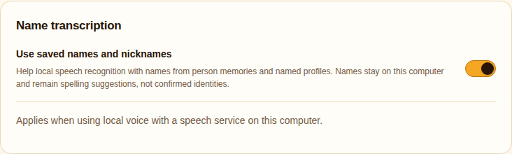
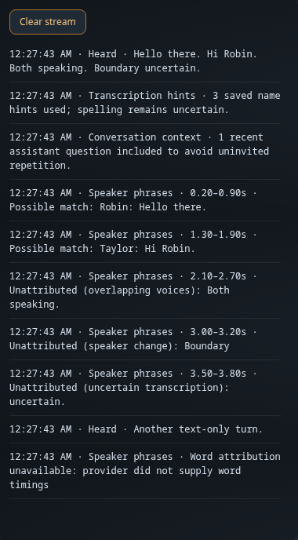

# Saved-name transcription hints

Local voice can give Whisper spelling suggestions from named face/voice profiles and existing Person memories (`name`, `nickname`, explicit `aliases`). The feature contains no household name list, phonetic replacements, inferred aliases or automatic identity links. Provider text is returned unchanged. A hint is not evidence that the named person spoke; uncertain introductions still require confirmation.

The Settings switch is enabled by default (`LOCAL_STT_NAME_HINTS=true`). Hints are sent only to speech services at localhost, 127.0.0.1 or ::1. Hinted requests reject redirects, preventing the multipart body from being forwarded elsewhere. LAN/remote endpoints do not read or send names. This feature applies to local voice, not Unmute's realtime transcription.

At most 16 terms and 300 characters are sent through Whisper's native `hotwords` field. Named profiles are read each turn; up to eight are prioritized by recent observation. Person names use an already-connected memory client, with a 30-second cache, a 500 ms memory timeout and a 100 ms overall foreground lookup budget. No new memory connection is opened before transcription. The first turn can therefore have profile hints only; normal recall establishes the connection for later turns. Failed refreshes clear memory hints and retry after five seconds. Changes to memory names can take 30 seconds to appear.

If a provider explicitly rejects hotwords, retry without them and remember that limitation for five minutes. Word-timing compatibility is tracked separately. Authentication failures, unrelated validation errors and redirects do not trigger a hint-removal retry. Debug shows hint state/count, never the name list. No extra model call, transcript rewrite, memory write or embedding is involved.

## Validation

333 unit tests pass, including cache, cancellation, unsupported-provider retries and actual HTTP 307/308 redirect blocking. Actual Settings browser checks cover default state, toggle/save and JavaScript errors. Debug and Settings screenshots use fictional data.

A local synthetic speech smoke test with fictional names produced “Hello, Cerys. I spoke to Maren today.” with native hotwords. Across three warm runs, median transcription took 206.1 ms without hints and 234.2 ms with hints. This verifies provider compatibility and a small sample of latency, not household accuracy, noisy-room performance or a guarantee that every nickname will be transcribed correctly. Live validation remains pending.

